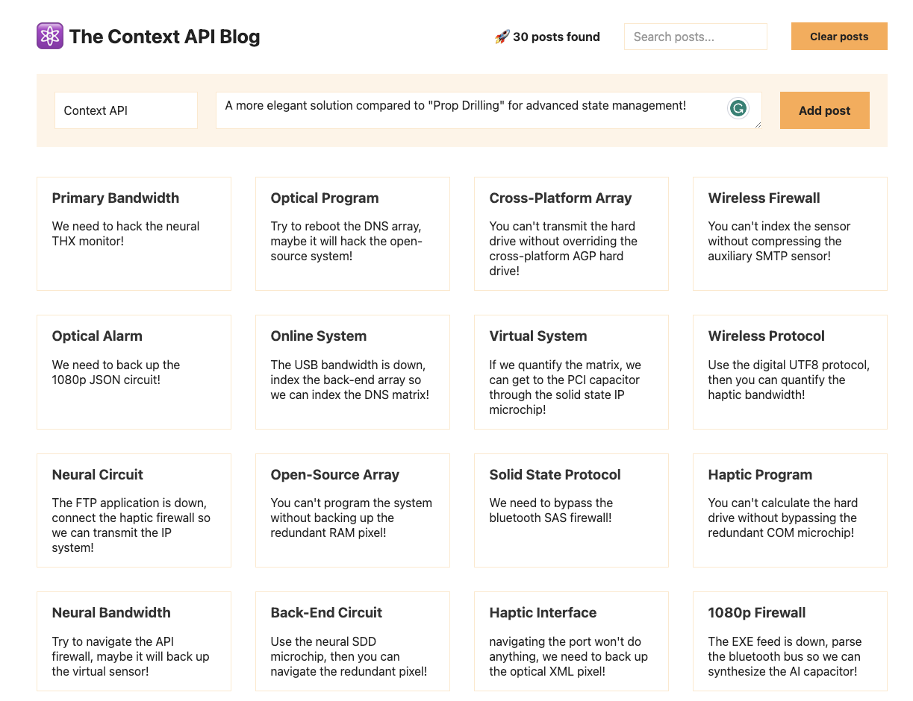
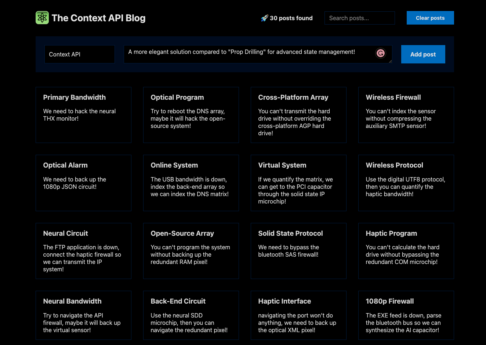

# The Context API Blog ✍️
A React-based blogging platform showcasing the power of the Context API for global state management. 

- This app features a dark mode toggle, dynamic post-generation, and a performant UI with memoized components. It demonstrates efficient state management patterns with search functionality and a scalable architecture for handling a large number of posts without prop drilling. 

- The blog emphasizes a clean separation of concerns with a PostProvider context, allowing for smooth state transitions and updates.

# Design & Layout 
> 
>
> 
> 
